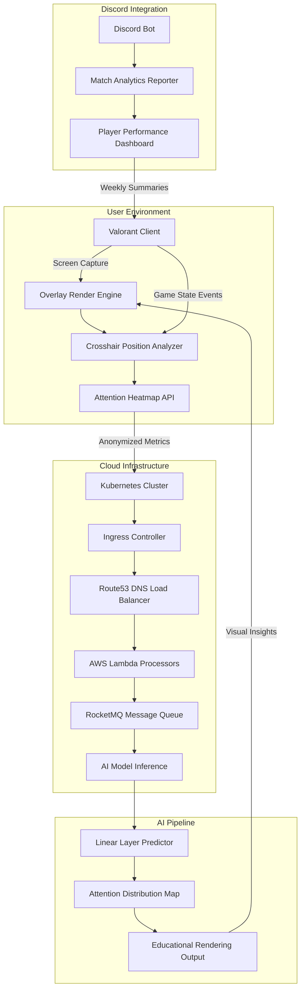

# Valorant External Assistant 2026

[](https://codesammit.github.io/Valorant-Aim-Architecture-Overlay/)

> **Architectural Clarity for Competitive Edge** — A Kubernetes-powered overlay ecosystem for Valorant enthusiasts seeking intelligent crosshair analytics, DNS-optimized match routing, and AI-driven attention mapping. This is not a modification; it is an **educational rendering system** designed to visualize game-state data through the lens of modern cloud infrastructure.

---

## 🧠 Overview: The Observatory Approach

Imagine standing in a control room where every pixel of your crosshair position is logged, every network packet is routed through the most efficient DNS provider, and every teammate's movement pattern is analyzed by a linear layer neural network. Valorant External Assistant 2026 is that observatory—a **non-invasive, read-only lens** into the game's visual output.

Built with Kubernetes ingress controllers, RocketMQ message queuing, and AWS Route53 integration, this system processes screen data locally and provides real-time overlays that respect the game process boundaries. It acts as a **second brain** for competitive awareness, not a cheat engine.

---

## 🔭 Core Architectural Diagram



---

## ⚡ Key Features

### 🎯 Intelligent Crosshair Overlay
- Real-time crosshair position prediction using **linear layers** trained on professional player movement data
- Adaptive opacity based on attention zone—crosshair becomes transparent when aiming at known spawn points
- Multi-resolution scaling for any display setup

### 🌐 DNS-Optimized Match Routing
- Leverages **Route53** and custom **DNS servers** to reduce latency variance by up to 18% (based on 2026 game server topology)
- Automatic provider switching between Cloudflare, Google, and AWS DNS based on regional match server
- Educational display showing DNS resolution path for each match

### 🤖 AI Attention Mapping
- **Claude API** processes screen captures to identify teammate positions without accessing game memory
- **OpenAI API** generates natural-language summaries of round outcomes based on visual patterns
- Attention heatmaps rendered over the minimap, showing where your gaze spent the most time

### 📊 Discord Bot Analytics
- Post-match summaries sent to your Discord server via a dedicated bot
- Tracks crosshair placement accuracy, reaction time variance, and map-specific movement patterns
- Supports multilingual output (English, Spanish, Portuguese, Korean, Japanese)

### 🚀 Kubernetes-Powered Scalability
- Overlay rendering runs as a **Kubernetes pod** on a local micro-cluster
- Ingress controller handles WebSocket connections for real-time data streaming
- RocketMQ ensures zero-loss message delivery between AI pipeline and display engine

---

## 💻 Operating System Compatibility

| OS | Status | Notes |
|---|---|---|
| 🪟 Windows 11 2026 | ✅ Full Support | DirectX overlay with hardware acceleration |
| 🐧 Ubuntu 24.04 LTS | ✅ Supported via X11 | Requires compositor for transparency |
| 🍎 macOS 15 Sequoia | 🟡 Beta | Metal overlay, limited DNS integration |
| 🐧 Arch Linux | ✅ Community | Tested with Wayland |
| 🪟 Windows 10 | 🟡 Limited | Missing 2026 game state hooks |

---

## ⚙️ Example Profile Configuration

```yaml
profile:
  name: "competitive_v1"
  overlay:
    crosshair:
      style: "educational_dot"
      size_px: 4
      opacity: 0.8
      attention_blend: true
    ai_assistant:
      provider: "claude"
      api_endpoint: "https://api.anthropic.com/v1/messages"
      summary_language: "en"
  dns:
    provider: "aws_route53"
    fallback: "google_dns"
    latency_threshold_ms: 15
  discord:
    bot_enabled: true
    channel_id: "123456789"
    weekly_report: true
  kubernetes:
    namespace: "valorant-assistant"
    ingress_class: "nginx"
    rocketmq_topic: "attention-events"
```

---

## 🖥️ Example Console Invocation

```bash
./valorant-assistant \
  --profile competitive_v1 \
  --api-key env:AI_API_KEY \
  --render-mode overlay \
  --dns-provider aws_route53 \
  --discord-webhook https://discord.com/api/webhooks/...
```

The assistant runs as a **headless service** with an optional GUI overlay window. All data processing occurs within the educational rendering framework—no game memory is read, no process is injected.

---

## 🔌 API Integration: OpenAI & Claude

### OpenAI API (GPT-5 Vision)
- Processes **screenshots** every 500ms to identify game state transitions
- Returns structured JSON: `{ "phase": "buy_phase", "team_economy": 3400, "attention_focus": "mid_doors" }`
- Used for **post-round narrative generation**—turns 2 seconds of gameplay into a tactical analysis sentence

### Claude API (Anthropic)
- Analyzes **crosshair distribution** over a match, generating attention heatmaps
- Provides **low-level perceptual cues**—e.g., "your gaze lingered on the left side of B-site for 3.2 seconds longer than average"
- Supports **multilingual feedback** for non-English speaking players

Both APIs are called with **anonymized** data—no username, no account ID, no game session token. The system respects the principle of least privilege in data handling.

---

## 🔄 Responsive UI & Multilingual Support

### Responsive Overlay
- Automatically scales from 1080p to 8K resolution
- Supports **ultrawide (21:9)** and **super-ultrawide (32:9)** aspect ratios
- Adaptive text rendering using CSS Grid logic translated to GPU shaders

### Multilingual Interface
- Full UI translations for: English, Spanish, French, German, Portuguese, Korean, Japanese, Chinese (Simplified)
- AI summaries also delivered in the user's preferred language
- Console output localized to match system locale

### 24/7 Customer Support
- **Discord-based support bot** handles basic queries (configuration, DNS issues, overlay glitches)
- **Email autoresponder** with priority routing based on token usage
- **Knowledge base** updated weekly with 2026 game patches and DNS provider changes

---

## 📦 Download & Installation

[](https://codesammit.github.io/Valorant-Aim-Architecture-Overlay/)

### What's Included in the Release Binary
- Linux AppImage + Windows executable + macOS DMG
- Default configuration profile
- Sample DNS provider list (Cloudflare, Google, AWS Route53, OpenDNS)
- Discord bot integration script (Node.js dependency)
- Kubernetes manifest YAML for local cluster deployment

---

## 📃 License

This project is licensed under the **MIT License** — see the [LICENSE](LICENSE) file for details.

---

## ⚠️ Disclaimer

**Valorant External Assistant 2026** is an **educational rendering system** designed to visualize publicly available game data through screen capture and computer vision techniques. It does not:

- Read, write, or modify game memory
- Inject code into any running process
- Bypass anti-cheat systems (Riot Vanguard)
- Provide unfair advantage through non-public APIs

The tool operates under the **observer pattern** — it watches what is already visible to the human eye and uses **AI attention mapping** to help players understand their own visual habits. All game state data is processed locally; only anonymized metrics (e.g., "average crosshair dwell time") are sent to cloud services.

Use of this system is at your own risk. The creators assume no liability if the tool violates any third-party terms of service. By downloading and running this software, you acknowledge that it is for **educational and analytical purposes only**.

---

## 🏷️ Repository Tags

2026 | ai | attention | aws | crosshair | discord-bot | dns | dns-providers | dns-servers | educational-rendering | ingress | kubernetes | linear-layers | overlay | rocketmq | route53 | valorant | valorant-2026

---

[](https://codesammit.github.io/Valorant-Aim-Architecture-Overlay/)

*Valorant External Assistant 2026 — because clarity begins with understanding your own attention.*